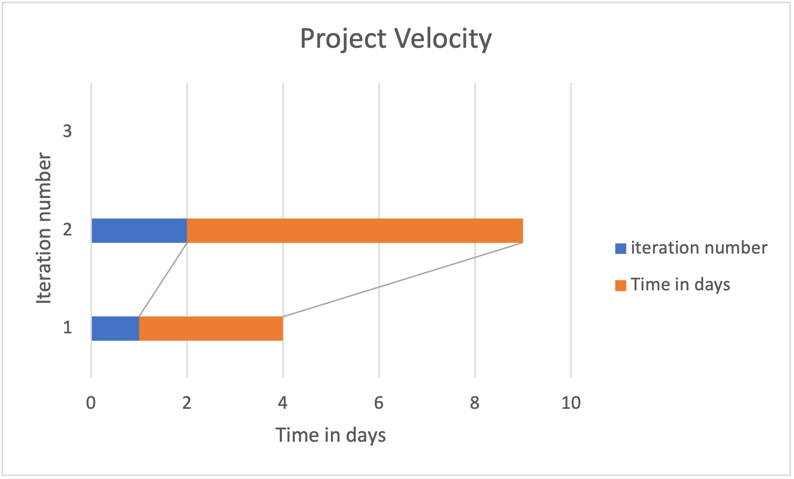

# **SUPERSET RETROSPECTIVE (GROUP 7)**

## **What worked?**

- We have had 4 hardworking active members throughout the first two iterations
- We were able to start out strong with a well rounded and compelling vision statement that was specific and realistic in Iteration 0 and was able to create the required features for Iteration 1 on time# What worked?

- We have had 4 hardworking active members throughout the first two iterations
- We were able to start out strong with a well rounded and compelling vision statement that was specific and realistic in Iteration 0 and was able to create the required features for Iteration 1 on time# What worked?

- We have had 4 hardworking active members throughout the first two iterations
- We were able to start out strong with a well rounded and compelling vision statement that was specific and realistic in Iteration 0 and was able to create the required features for Iteration 1 on time
- We were also able to connect our app to the HSQL persistence layer which was the most challenging part about Iteration 2 that we managed to overcome thanks to our team effort

## **What did not work?**

- For the first two iterations, we had one inactive member (didn’t attend class or join our Discord group when we contacted them) and didn’t contribute to the process at all.
- All team members had other courses that required huge time commitments in addition to COMP 3350 which lead to us not being able to meet some of the deadlines for some of the developer tasks assigned, pushing back our project development
- Navigating Android Studio with no prior knowledge took a lot of time and effort that  resulted in a slower than anticipated developer process, hindering us from achieving some goals we set at previous iterations as we overestimated our abilities and underestimated the degree of difficulty of some assigned tasks

## **How can our team improve?**

- Our group has made an effort towards better communication by attending our weekly classes, making them a place to talk about our to-dos and plan future tasks
    - We started writing code together (in close proximity) which led to more interaction and higher productivity, enabling us to finish more developer tasks when compared to working individually
- Our team distributed developer tasks across all members after considering other time commitments to be considerate and realistic at the same time
- Our team figured out how powerful visibility was in regards to maintaining a good project velocity near the end of the course
    - We found that it helped everyone in the team in knowing how everyone else was progressing and what other team members could do to boost the developer process which led to more synergy and realistic expectations for future iterations
- Not skipping the retrospective discussions is very powerful as it allows members to locate where system failures actually are rather than just passing blame onto one another, which helps out with the planning of future iterations and leads to better performance as a whole√
- We were also able to connect our app to the HSQL persistence layer which was the most challenging part about Iteration 2 that we managed to overcome thanks to our team effort

## **Project velocity**

*Iteration 1 had a project velocity of 3 days as we grouped together last minute to complete the features for it, whereas for Iteration 2 we learned from our previous experience and started working on it earlier to complete the features and persistence layer for Iteration 2 which took longer. Furthermore, from knowing more about project velocity from the previous two iterations we have planned out and started earlier on Iteration 3 to complete testing and the presentation, so our projected project velocity for Iteration 3 will be higher.*